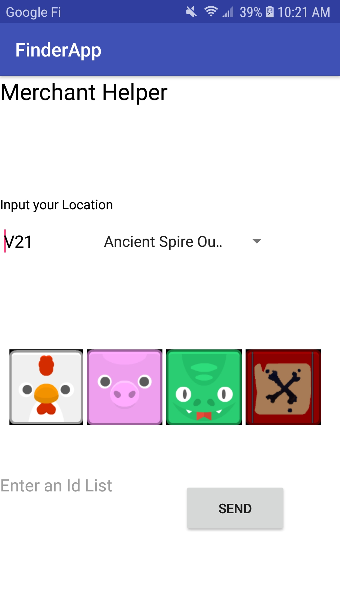
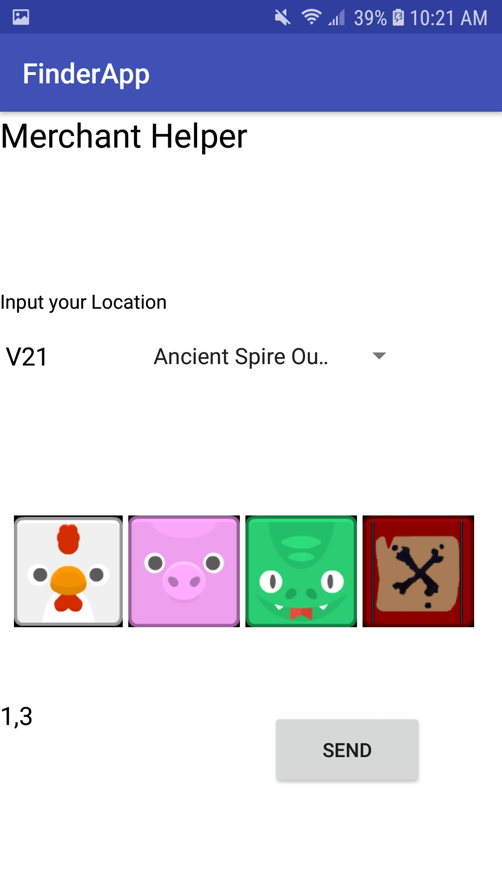
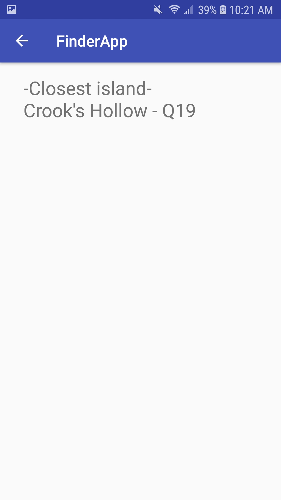
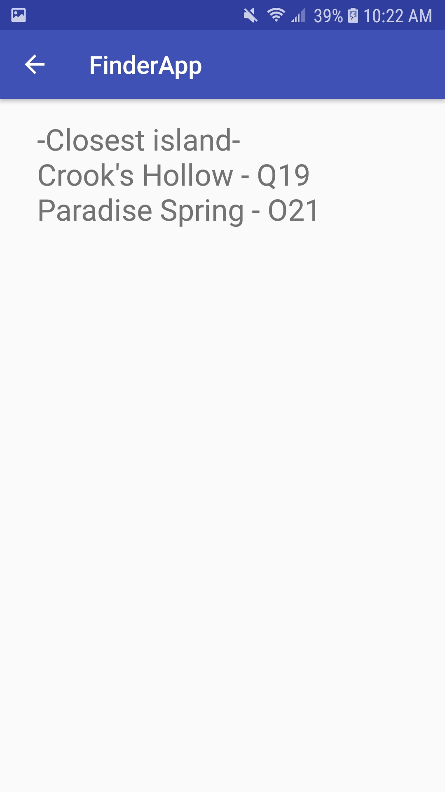

# MerchantHelper-Android
The Merchant Helper app ported to an Android Application

This application is very rough looking and basic, as it was originally intended only for personal use to become more efficient while playing Sea of Thieves.

It consists of two screens:
- Input Screen: Start view where one inputs their exact location through text field or pick an island, and select the desired resources via the buttons (Animals and/or Gunpowder).
- Result Screen: View which displays islands to travel to, in order, to obtain the desired resources.

Examples:

- Single Island

- Multiple Islands

